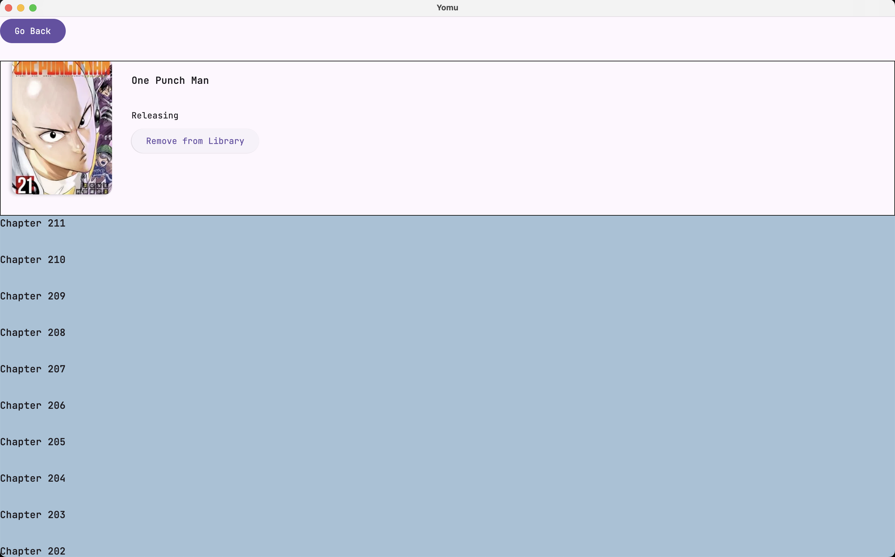

<!-- PROJECT LOGO -->
 

  

<h3 align="center">Yomu</h3>

  

     A Manga Reader made in Kotlin MultiPlatform
 

Currently supports Android and Desktop

     
  <!--  <a href=""><strong>Explore the docs »</strong></a>
     
     
    <a href="">View Demo</a>
    ·
    <a href="">Report Bug</a>
    ·
    <a href="">Request Feature</a> -->
 

  

  
  
  

## Technologies Used
Kotlin Multiplatform

<!-- ROADMAP -->
## To Do

- [ ] Add Settings Page configuration
- [x] Implement add to library
- [x] Fix scaling in latest/popular page
- [ ] Add +18 filter in app and backend
- [ ] Add Search Bar on Source
- [ ] Add buttons to go back for desktop
- [ ] IOS fix

<!--See the [open issues](https://github.com/othneildrew/Best-README-Template/issues) for a full list of proposed features (and known issues). -->

(<a href="#readme-top">back to top</a>)
