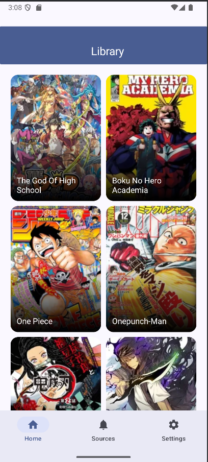
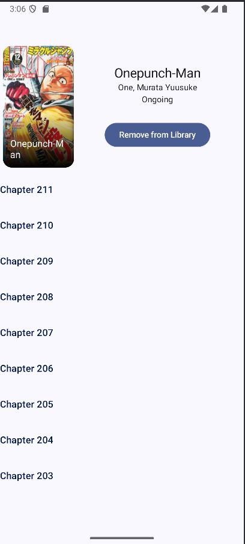
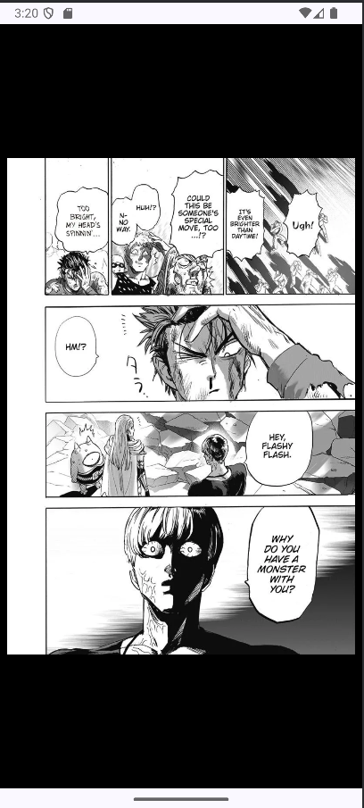

<!-- PROJECT LOGO -->
 

  

  <h3 align="center">Yomu App</h3>

  

     A Manga Reader in Development
     
  <!--  <a href=""><strong>Explore the docs »</strong></a>
     
     
    <a href="">View Demo</a>
    ·
    <a href="">Report Bug</a>
    ·
    <a href="">Request Feature</a> -->
  

  

<!-- ROADMAP -->
## Roadmap

- [x] Add Popular bar to source
- [x] Add Search bar to source
- [x] Add Library Function
- [x] Fix Manga Info
- [x] Fix Look Library
- [x] Limit requests and cache info
- [ ] Improve Chapter Reading in Webtoons and Mangas

<!--See the [open issues](https://github.com/othneildrew/Best-README-Template/issues) for a full list of proposed features (and known issues). -->

(<a href="#readme-top">back to top</a>)

